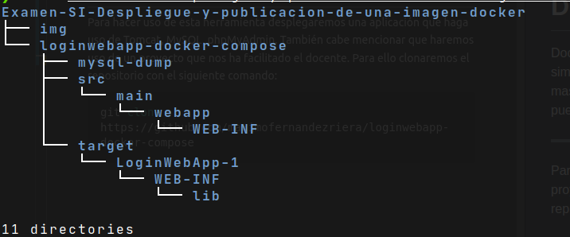
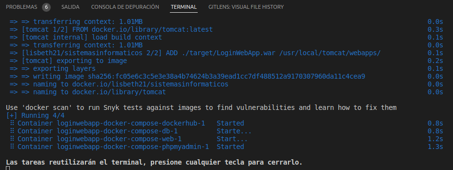
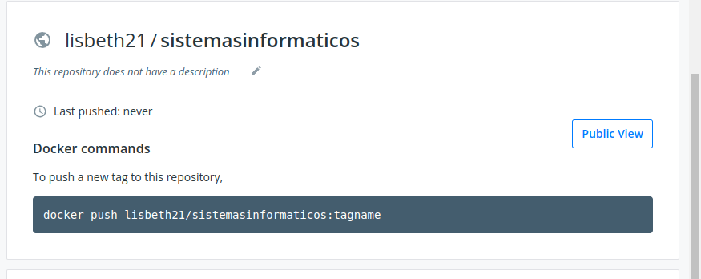
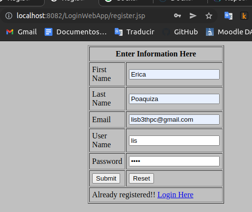
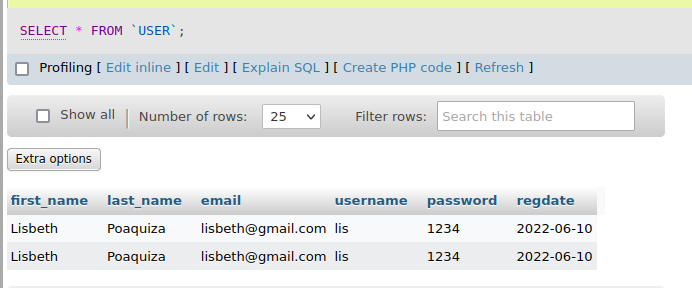

# Examen Sistemas Informaticos

Docker Compose es una herramienta que permite simplificar el uso de Docker. A partir de un archivo .yalm es más sencillo crear contenedores, conectarlos, configurar puertos, etc.

---

Para hacer uso de esta herramienta desplegaremos una aplicación que haga uso de Tomcat, MySQL, phpMyAdmin. También cabe mencionar que haremos uso de un proyecto que nos ha facilitado el docente. Para ello clonaremos el repositorio con el siguiente comando:

```bash
git clone https://github.com/maximofernandezriera/loginwebapp-docker-compose
```

Quedándonos una estructura de directorios tal que así:



Ahora bien, las tablas del directorio `mysql-dump` tienen un error, por lo que cambiaremos el archivo que esta ahí, especificamente la tabla *USER*, quedando de la siguiente forma:

```sql
CREATE TABLE `USER` (
  `first_name` varchar(20) NOT NULL,
  `last_name` varchar(20) NOT NULL,
  `email` varchar(20) NOT NULL,
  `username` varchar(20) NOT NULL,
  `password` varchar(20) NOT NULL,
  `regdate` date not null,
  
) ENGINE=InnoDB DEFAULT CHARSET=latin1;
COMMIT;
```

Creamos un archivo [docker-compose.yml](loginwebapp-docker-compose/docker-compose.yml) y empezamos a montar la imágen (He añadido comentarios al archivo).

Antes de hacer un `docker-compose up` es necesario estar logueado con nuestras credenciales de DockerHub:

```bash
docker login
```

Y crear un repositorio con el mismo nombre que le indicaremos en el `docker-compose.yml`

Ahora si podemos hacer un `docker-compose up` dentro del directorio del proyecto. Se nos mostrará algo parecido por comando:




Y en DockerHub se muestra lo siguiente: 



### **Aquí se puede descargar la imágen:**

https://hub.docker.com/r/lisbeth21/sistemasinformaticos

----

## Comprobación que la imagen funcione

----

Si nos dirigimos a la siguiente ruta ([RUTA](http://localhost:8082/LoginWebApp/register.jsp)) en nuestro navegador se nos mostrará lo siguiente:



Así pues el `TOMCAT` funciona. Ahora comprobamos tanto phpMyAdmin y mySQL, para ello comprobaremos que el usuario que he ingresado este ahí:




Todo esta correcto. 